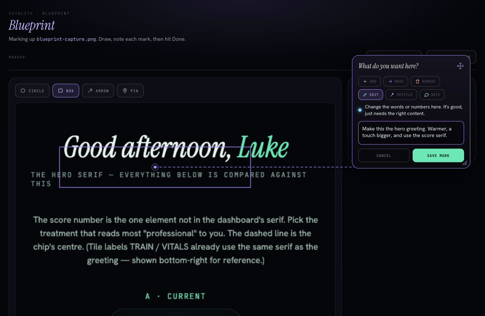

# Blueprint

**Draw on a screenshot. Hand Claude exactly what you mean, and where.**

Blueprint is a Claude Code plugin. Run it, draw on a picture of your app, type a short note on
each mark, and click Done. Claude gets the marked-up image **and** your notes automatically.
No copy-paste, no describing pixel positions in words.



> Circle a spot, write "make this the hero greeting, warmer and bigger," and Claude sees the
> picture and the intent in one shot. Pointing is faster than describing.

---

## Install

Two lines, once:

```
/plugin marketplace add https://github.com/ohwisey/blueprint.git
/plugin install blueprint
```

Run these in a **terminal `claude` session** (the `/plugin` command isn't available in the
VS Code/JetBrains chat panel). That's it. Now you have `/blueprint` in every project.

## Use it

```
/blueprint path/to/screenshot.png
```

or just:

```
/blueprint
```

…and paste a URL, drop in an image, or give a file path when it asks.

A browser tab opens with your image on a canvas. Then:

1. **Pick a tool** — circle, box, arrow, or pin.
2. **Draw** on the part you mean.
3. **Tag it and write a note** — say it like you'd say it out loud.
4. **Click Done.**

Claude reads your marked-up image and notes, and gets to work. Output lands in
`<your project>/.blueprint/` (git-ignored).

## The six intents

Each mark gets one tag so Claude knows what you want, not just where:

| Tag | Color | Means |
|-----|-------|-------|
| **Add** | mint | Put something new right here. |
| **Move** | iris | Pick this up and put it somewhere else. |
| **Remove** | amber | Take this out completely. |
| **Edit** | sky | Keep it, just fix the words or numbers. |
| **Restyle** | violet | Keep it, change how it looks. |
| **Note** | green | A comment for Claude. Nothing has to change. |

## Nice touches

- **Drag the note card anywhere** by its title bar, so it never covers the spot you marked.
- **A leader line** connects the card back to your mark, so you never lose the spot on a long page.
- **Resize the card** from its corner when you have a lot to say.
- Works on a **URL** (Claude screenshots the page for you) or any **image** you give it.

---

## Examples

### A single mark

You circle the middle of a dashboard and tag it **Add**:

> "Vee tile goes here. Make it the motherboard, wired to every other tile."

Claude receives a `blueprint.md` like this:

```
# Blueprint
Target: dashboard.png
Marks: 1

[1] circle at dead center — ADD
      Vee tile goes here. Make it the motherboard, wired to every other tile.
      coords: center {x:0.50,y:0.50} r {x:0.12,y:0.18} (img 1280x720)
---
Instruction to Claude: apply each mark to the design. Numbers above match the
circled numbers on annotated.png.
```

…plus `annotated.png` (your image with a numbered badge on the mark). Claude reads the image
by path so it enters vision cleanly, reads the notes inline, and applies each mark.

### A few marks at once

Box the header → **Restyle** ("flatter, less shadow"). Arrow from the logo to the corner →
**Move**. Pin the footer → **Remove**. One Done, and Claude has the whole change set with the
exact locations.

See [`examples/`](examples/) for full sample output.

---

## Requirements

- **Node.js** for the seamless path (Blueprint runs a tiny local server on `127.0.0.1` to catch
  your work). No Node? It falls back to a one-click download Claude reads from your Downloads —
  zero setup either way.
- Any modern browser.

## How it works

- `/blueprint` starts a tiny **loopback web server** that serves the annotation canvas at
  `http://127.0.0.1:PORT/`. Loopback-to-loopback needs no permission prompt and no CORS, so it's
  friction-free in every browser.
- On **Done**, the page sends back the annotated PNG + your marks. The server writes
  `annotated.png`, `blueprint.md`, and a `paths.json` sentinel into `.blueprint/` in your project.
- A Stop hook hands those to Claude, who reads the image by path and applies each numbered mark.

Everything stays on your machine. Nothing is uploaded.

## License

MIT
